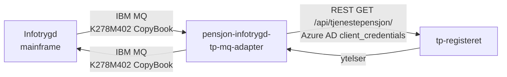

# pensjon-infotrygd-tp-mq-adapter

Mottar meldinger fra Infotrygd på IBM MQ, slår opp tjenestepensjonsytelser i TP-registeret og sender svar tilbake. Meldingene fra Infotrygd kommer på CopyBook-format med EBCDIC-tegnsett.

## Arkitektur



## Meldingsformat

Applikasjonen bruker CopyBook-meldingsformatet `K278M402`.

### Input (fra Infotrygd)

| Felt | Type | Beskrivelse |
|------|------|-------------|
| `iFnr` | `9(11)` | Fødselsnummer det søkes på |
| `iFom` | `S9(6) Comp-3` | Fra-dato for periode (valgfri) |
| `iTom` | `S9(6) Comp-3` | Til-dato for periode (valgfri) |

### Output (til Infotrygd)

| Felt | Type | Beskrivelse |
|------|------|-------------|
| `oTPnr` | `S9(4) Comp-3` | Tjenestepensjonsnummer (ordningsnummer) |
| `oTPart` | `9` | Ytelsestype: 1=Alder, 2=Uføre, 3=Gjenlevende, 5=Barn, 6=AFP |
| `oFom` | `S9(6) Comp-3` | Dato ytelse ble iverksatt fra |
| `oTom` | `S9(6) Comp-3` | Dato ytelse ble iverksatt til (null = pågående) |

## Feilhåndtering

| `alvorlighetsgrad` | `beskMelding` | Årsak |
|--------------------|---------------|-------|
| `0` | `INGEN FEIL PÅ RETURNERT MELDING` | Ytelser funnet og returnert |
| `4` | `INGEN DATA FUNNET` | Ingen ytelser for angitt fnr/periode |
| `8` | `SYSTEMFEIL` | Uventet feil ved oppslag mot TP-registeret |

## Tech stack

- **Språk:** Kotlin · Java 21
- **Rammeverk:** Spring Boot 3
- **Meldingskø:** IBM MQ (JMS)
- **Auth:** Azure AD client_credentials
- **Plattform:** Nais (FSS) · Vault · OpenTelemetry → Elastic APM

## Bygg og test

```shell
./mvnw clean verify
```

## Kjøre applikasjonen lokalt mot testmiljø

> [!NOTE]
> Dette krever tilgang til Nav sine testmiljø via _naisdevice_.

Opprett en `.env-fil` med hemmeligheter og konfigurasjon for miljøet ved å
kjøre følgende kommando.

```shell
./fetch-secrets.sh
```

Om du ønsker å kjøre mot et annet miljø kan du spesifisere dette som et argument til
`fetch-secrets.sh`. Om du for eksempel ønsker å kjøre mot Q1 så kan du kjøre følgende kommando

```shell
./fetch-secrets.sh Q1
```

I IntelliJ, naviger til klassen `Application`, trykk høyre museknapp på startikonet og
velg `Modify Run Configuration...` fra menyen. Under `Environment variables`
legger du til stien til `.env-filen` som ble opprettet. Om
`Environment variables` ikke vises legger du til dette valget ved å trykke på
`Modify options` og velge `Environment variables` fra menyen som vises.

> [!NOTE]
> Instansene som allerede kjører i miljøet vil fortsette å lese meldinger fra kø. For å være sikker på at du mottar
> meldinger lokalt må du kjøre ned instansene i miljøet du vil kjøre mot.

## Kontakt

- **Team:** Pensjonsamhandling
- **Slack:** [#pensjon_samhandling](https://nav-it.slack.com/archives/pensjon_samhandling)
